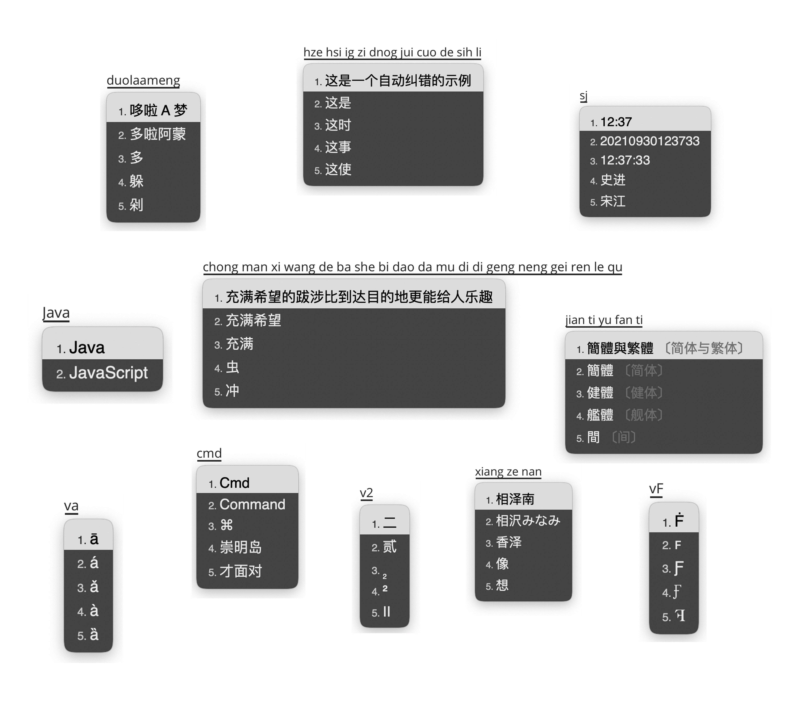

# 自用 Rime 配置

## 基本套路：

-   Squirrel 0.15.2 简体 全拼
-   「[袖珍简化字方案](https://github.com/rime/rime-pinyin-simp)」作为基础
    -   [简繁切换](https://github.com/rime/home/issues/388#issuecomment-504572224)
    -   [动态日期、时间、星期](https://github.com/KyleBing/rime-wubi86-jidian)
    -   所有标点符号直接上屏，「/」模式改为「v」模式，「/」直接上屏
    -   删除了「[Emoji](https://github.com/rime/rime-emoji)」，改为词语与符号映射
    -   增加了许多拼音纠错
-   融合「[easy_en](https://github.com/BlindingDark/rime-easy-en)」英文输入方案
    -   使用了「[融合拼音](https://github.com/tumuyan/rime-pinyin-simp)」的词库和拼写规则
-   纯简体字表、词库（这样在用户词典中也是简体了）
    -   字表：[《通用规范汉字表》的 8105 字字表](https://github.com/iDvel/The-Table-of-General-Standard-Chinese-Characters)
    -   词库：「[华宇野风系统词库](http://bbs.pinyin.thunisoft.com/forum.php?mod=viewthread&tid=30049)」 +「[清华大学开源词库](https://github.com/thunlp/THUOCL)」
    -   「[简体八股文语言模型](https://github.com/lotem/rime-octagram-data/tree/hans)」
-   长期持续修订遇到的异形词、错别字、错误注音

 

**部署前请先将 `pinyin_simp.dict.yaml` 中的 `- cn_dicts/private` 这行删除，这是我自己的私人词库（联系人之类的），否则部署时会报错。**

 

详细介绍：[我的 Rime 配置 2022](https://dvel.me/posts/my-rime-setting-2022/)
