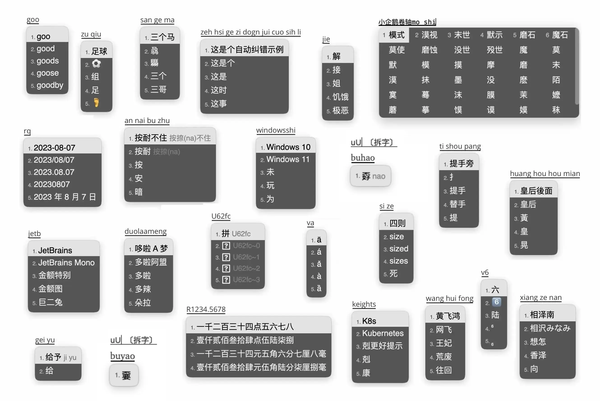

# 由雾凇拼音修改而来的自用 Rime 配置



功能齐全，词库体验良好，长期更新修订。

<br>

[Rime Input Method Engine / 中州韵输入法引擎](https://rime.im/) 是一个跨平台的输入法算法框架。

这里是 Rime 的一份配置仓库，用户需要下载各平台对应的前端，并将此配置应用到配置目录。

雾凇拼音提供了一套开箱即用的完整配置，包含了输入方案（全拼、双拼）、长期维护的词库及各项扩展功能。

详细介绍：[Rime 配置：雾凇拼音](https://dvel.me/posts/rime-ice/)

[常见问题](https://github.com/iDvel/rime-ice/issues/133)

[更新日志](./others/CHANGELOG.md)

<br>

## 基本套路

- 简体 | 全拼 | 双拼
- 主要功能
    -   [melt_eng](https://github.com/tumuyan/rime-melt) 英文输入（@tumuyan | [Apache 2.0](https://github.com/tumuyan/rime-melt/blob/master/LICENSE)）
    -   [优化英文输入体验](https://dvel.me/posts/make-rime-en-better/)
    -   [部件拆字方案](https://github.com/mirtlecn/rime-radical-pinyin) 反查、辅码（@mirtlecn | [CC BY-SA 4.0](https://github.com/mirtlecn/rime-radical-pinyin/blob/master/LICENSE)）
    -   自整理的 Emoji
    -   [以词定字](https://github.com/BlindingDark/rime-lua-select-character)（@BlindingDark | [LGPL 3.0](https://github.com/BlindingDark/rime-lua-select-character/blob/master/LICENSE)）
    -   [长词优先](https://github.com/tumuyan/rime-melt/blob/master/lua/melt.lua)（@tumuyan | [Apache 2.0](https://github.com/tumuyan/rime-melt/blob/master/LICENSE)）
    -   [Unicode](https://github.com/shewer/librime-lua-script/blob/main/lua/component/unicode.lua)（@shewer | [MIT](https://github.com/shewer/librime-lua-script/blob/main/lua/component/unicode.lua)）
    -   [数字、人民币大写](https://github.com/yanhuacuo/98wubi/blob/master/lua/number.lua)（@98wubi）
    -   日期、时间、星期、[农历](https://github.com/boomker/rime-fast-xhup)（@boomker | [LGPL 3.0](https://github.com/boomker/rime-fast-xhup/blob/master/LICENSE)）
    -   常见错音错字提示
    -   置顶候选项
    -   所有标点符号直接上屏，/ 模式改为 v 模式，/ 直接上屏
    -   增加了许多拼音纠错
- 简体字表、词库
    -   [《通用规范汉字表》](https://github.com/iDvel/The-Table-of-General-Standard-Chinese-Characters)
    -   [华宇野风系统词库](http://bbs.pinyin.thunisoft.com/forum.php?mod=viewthread&tid=30049)（@野风）
    -   [清华大学开源词库](https://github.com/thunlp/THUOCL)（@THUNLP | [MIT](https://github.com/thunlp/THUOCL/blob/master/LICENSE)）
    -   [现代汉语常用词表](https://gist.github.com/indiejoseph/eae09c673460aa0b56db)（@Joseph cheng）
    -   [腾讯词向量](https://ai.tencent.com/ailab/nlp/en/download.html)（@Tencent AI Lab | [CC BY 3.0](https://creativecommons.org/licenses/by/3.0/)）
    -   参考
        -   《现代汉语词典》
        -   《同义词词林》
        -   《新华成语大词典》
- 词库修订
    - 校对大量异形词、错别字、错误注音
    - 全词库完成注音
    - 同义多音字注音

<br>

## 长期维护词库

因为没有找到一份比较好的词库，干脆自己维护一个。综合了几个不错的词库，精心调教了很多。

主要维护的词库：

- `8105` 字表。
- `base` 基础词库。
- `sogou` 搜狗流行词。
- `ext` 扩展词库，小词库。
- `tencent` 扩展词库，大词库。
- Emoji

维护内容主要是异形词、错别字的校对，错误注音的修正，缺失的常用词汇的增添，词频的调整。

欢迎在词库方面提 issue [#666](https://github.com/iDvel/rime-ice/issues/666) ，我会及时更新修正。

<br>

## 使用说明

⚠️ 单独使用词库注意事项：`rime_ice.dict.yaml` 下面包含了大写字母，这和配置有些许绑定，可以直接删除，详细说明：[#356](https://github.com/iDvel/rime-ice/issues/356)

雾凇拼音中多个文件可能与其他方案同名冲突，如果是新手想一键安装，建议备份原先配置，清空配置目录再导入。

配置目录为小狼毫的 `%APPDATA%\Rime`，鼠须管的 `~/Library/Rime`，可通过右键菜单栏图标打开。

### 手动安装

您可以将仓库打包下载，或者整体 clone 后，将所有文件复制粘贴到配置目录，重新部署。

更新词库，手动覆盖 `cn_dicts` `en_dcits` `opencc` 三个文件夹。

您也可以前往 [Release](https://github.com/iDvel/rime-ice/releases) 界面，下载特定版本的词典文件（具体描述见 Release 说明），覆盖配置目录的对应文件。

### 东风破 [plum](https://github.com/rime/plum)

选择配方（`others/recipes/*.recipe.yaml`）来进行安装或更新。

词库配方只是更新具体词库文件，并不更新 `rime_ice.dict.yaml` 和 `melt_eng.dict.yaml`，因为用户可能会挂载其他词库。如果更新后部署时报错，可能是增、删、改了文件名，需要检查上面两个文件和词库的对应关系。

℞ 安装或更新全部文件

```
bash rime-install iDvel/rime-ice:others/recipes/full
```

℞ 安装或更新所有词库文件（包含下面三个）

```
bash rime-install iDvel/rime-ice:others/recipes/all_dicts
```

℞ 安装或更新拼音词库文件（ `cn_dicts/` 目录内所有文件）

```
bash rime-install iDvel/rime-ice:others/recipes/cn_dicts
```

℞ 安装或更新英文词库文件（ `en_dicts/` 目录内所有文件）

```
bash rime-install iDvel/rime-ice:others/recipes/en_dicts
```

℞ 安装或更新 opencc （ `opencc/` 目录内所有文件）

```
bash rime-install iDvel/rime-ice:others/recipes/opencc
```

下面这个配方会在 `radical_pinyin.custom.yaml` 和 `melt_eng.custom.yaml` 里将 `speller/algebra` 修改为对应的双拼拼写，选择一个自己使用的双拼作为参数。

℞ 双拼补丁

```
bash rime-install iDvel/rime-ice:others/recipes/config:schema=flypy
bash rime-install iDvel/rime-ice:others/recipes/config:schema=double_pinyin
bash rime-install iDvel/rime-ice:others/recipes/config:schema=mspy
bash rime-install iDvel/rime-ice:others/recipes/config:schema=sogou
bash rime-install iDvel/rime-ice:others/recipes/config:schema=abc
bash rime-install iDvel/rime-ice:others/recipes/config:schema=ziguang
```

℞ 下载特定版本的配置

在仓库后加 `@tag` 即可，例如：

```sh
bash rime-install iDvel/rime-ice@2024.05.21:others/recipes/full
```

### 仓输入法 [Hamster](https://github.com/imfuxiao/Hamster)

参考 [如何导入"雾淞拼音输入方案"](https://github.com/imfuxiao/Hamster/wiki/%E5%A6%82%E4%BD%95%E5%AF%BC%E5%85%A5%22%E9%9B%BE%E6%B7%9E%E6%8B%BC%E9%9F%B3%E8%BE%93%E5%85%A5%E6%96%B9%E6%A1%88%22)

仓输入法目前已内置雾凇拼音，也可以通过【输入方案设置 - 右上角加号 - 方案下载 - 覆盖并部署】来更新雾凇拼音。

使用九宫格，需要同时启用九宫格方案（输入方案设置）和九宫格布局（键盘设置 - 键盘布局 - 中文 9 键）。

### 自动部署脚本

[Mark24Code/rime-auto-deploy](https://github.com/Mark24Code/rime-auto-deploy) 一个自动部署脚本，集成了雾凇拼音，帮助无痛快速安装、部署 Rime 输入法（中州韵、小狼毫，鼠须管）以及部署配置。

### Arch Linux

使用 AUR helper 安装 [rime-ice-git](https://aur.archlinux.org/packages/rime-ice-git) 包即可。

```bash
# paru 默认会每次重新评估 pkgver，所以有新的提交时 paru 会自动更新，
# yay 默认未开启此功能，可以通过此命令开启
# yay -Y --devel --save

paru -S rime-ice-git
# yay -S rime-ice-git
```

推荐使用[补丁](https://github.com/rime/home/wiki/Configuration#補靪)的方式启用。

参考下面的配置示例，修改对应输入法框架用户目录（见下）中的 `default.custom.yaml` 文件

- iBus 为 `$HOME/.config/ibus/rime/`
- Fcitx5 为 `$HOME/.local/share/fcitx5/rime/`

<details>
<summary>default.custom.yaml</summary>

```yaml
patch:
  # 仅使用「雾凇拼音」的默认配置，配置此行即可
  __include: rime_ice_suggestion:/
  # 以下根据自己所需自行定义，仅做参考。
  # 针对对应处方的定制条目，请使用 <recipe>.custom.yaml 中配置，例如 rime_ice.custom.yaml
  __patch:
    key_binder/bindings/+:
      # 开启逗号句号翻页
      - { when: paging, accept: comma, send: Page_Up }
      - { when: has_menu, accept: period, send: Page_Down }
```

</details>

<br>

### 用户手册

#### 1. 选项菜单
在输入状态时，<kbd>F4</kbd> 或者 <kbd>control</kbd> + <kbd>`</kbd> 弹出菜单

#### 2. 菜单内容
弹出的菜单中，处于第一位的是当前使用的输入法方案，其后跟着是该方案中的输入法菜单，有【袖珍简化字拼音】、【简 ──> 繁繁繁】、【大写数字】、【特殊字符】等常见功能菜单，再后面是其它可选的输入法方案，对应 [`default.custom.yaml`](https://github.com/appleshan/fcitx5-rime-dict/blob/main/default.custom.yaml) 中 `schema_list` 字段内容

#### 3. 默认二三候选
默认的二三候选是 <kbd>;</kbd> <kbd>'</kbd> 两个键

#### 4. 候选翻页
方向 <kbd>上</kbd><kbd>下</kbd>、<kbd>-</kbd> <kbd>=</kbd>

#### 5. 支持 简入繁出
是以切换输入方案的形式实现的，使用时，调出菜单，选择 `简 ──> 繁繁繁` 方案即可
简繁转换的功能能实现：
- 转繁体
> 以不切换文字的形式使用只是暂时转繁，换个程序就会恢复简体了。如果你想一直使用简入繁出就选择 「简入繁出」这个方案

#### 6. 系统 `时间`、`日期` 和 `星期`
输入对应词，获取当前日期和时间
- `rq` 输出日期，格式 `2019年06月19日` `2019-06-19`
- `sj` 输出时间，格式 `10:00` `10:00:00`
- `xq` 输出星期，格式 `周四` `星期四`

#### 7. 支持大写数字输入：壹贰叁肆伍陆
本库中包含一个可以输入大写数字的方案，名叫 `大写数字`，呼出菜单选择该方案即可。
在这个模式下：具体可以看源文件 [`numbers.schema.yaml`](https://github.com/appleshan/fcitx5-rime-dict/blob/main/numbers.schema.yaml)


| 键           | 对应值             | | 键 (按住 shift) | 对应值            |
|-------------|--------------------|---|-----------|-------------------|
| 1234567890  | 壹贰叁肆伍陆柒捌玖零  | | 1234567890 | 一二三四五六七八九〇  |
| wqbsjfd.    | 万仟佰拾角分第点     | | wqbsjfd.   | 万千百十角分点       |
| z           | 整之               | | z          | 整之               |
| y           | 元月亿             | | y          | 元月亿             |

#### 8. 特殊字符快捷输入
默认是开启的，具体可以查看 wiki [如何启用 ` /fh` 这种特殊符号输入](https://github.com/KyleBing/rime-wubi86-jidian/wiki/%E5%A6%82%E4%BD%95%E5%90%AF%E7%94%A8-%60--fh%60-%E8%BF%99%E7%A7%8D%E7%89%B9%E6%AE%8A%E7%AC%A6%E5%8F%B7%E8%BE%93%E5%85%A5)

使用方法改成类似 `vfh` 按键，即以 `v` 作为前缀按键。

#### 9. IntelliJ 系列软件的 IDE 中输入框位置不正确
此问题的根本原因是 IDE 附带的 JBR 不正确，要处理此问题，需要：
1. 前往 [Release 17.0.6-b829.5](https://github.com/RikudouPatrickstar/JetBrainsRuntime-for-Linux-x64/releases) 下载 jbr 并解压到任意路径
2. 按照 [此指导](https://intellij-support.jetbrains.com/hc/en-us/articles/206544879-Selecting-the-JDK-version-the-IDE-will-run-under) 更改 IDE 的 JBR

## 感谢 ❤️

感谢贡献者 Dvel 。

详细介绍：[Rime 配置：雾凇拼音](https://dvel.me/posts/rime-ice/)

